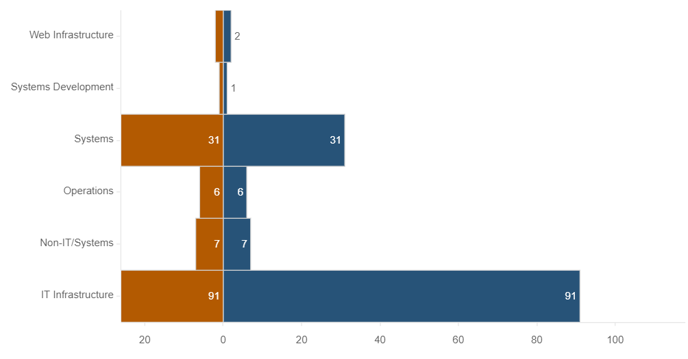

# Pyramid



### Vanilla JavaScript

- See the [HTML Template](https://github.com/qlik-demo-team/qdt-components/blob/master/docs/usage/Html.md) for the
basic page setup. 

```js
var options = {
  config: { /* host, port, appid, etc. */ },
  connections: { /* vizApi, engineAPI */}
}

var qdtComponents = new QdtComponents(options.config, options.connections);

var element = document.getElementById('qdt1');

qdtComponents.render(
  "QdtPicasso", 
  {
    type: 'pie', 
    cols: [
      'Case Owner Group',
      '=Num(Avg([Case Duration Time]), "##")'
    ],
    outerHeight: 300,
  }, 
  element
);
```

### React

```jsx
const chart_options = {
  type: 'QdtPicasso',
  props: {
    type: 'pie',
    cols: [
      'Case Owner Group',
      '=Num(Avg([Case Duration Time]), "##")'
    ],
    outerHeight: 300,
  },
};

const App = () => {
    return (
        <main>
            <QdtComponent {...chart_options} />
        </main>
    )
}

render(<App />, document.getElementById('root'));
```

### Angular

```js
// pie-chart.component.ts
import { Component, OnInit, ElementRef } from '@angular/core';

@Component({
  selector: 'picasso-pie-chart',
  templateUrl: './picasso-pie-chart.component.html',
})
export class PicassoPieChartComponent implements OnInit {

  constructor(private el: ElementRef) { }

  chart_options = {
    type: 'QdtPicasso',
    props: {
      type: 'pie',
      cols: [
        'Case Owner Group',
        '=Num(Avg([Case Duration Time]), "##")'
      ],
      outerHeight: 300,
    },
  };

  ngOnInit() {

  }

}
```

```html
<!-- html -->
<picasso-pie-chart [Component]="chart_options.type" [props]="chart_options.props"></picasso-pie-chart>
```

[← QdtPicasso](../)