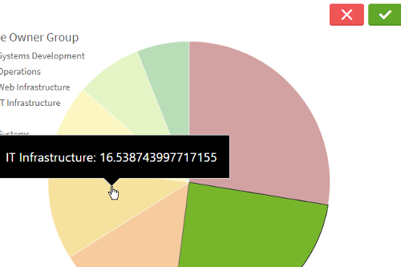
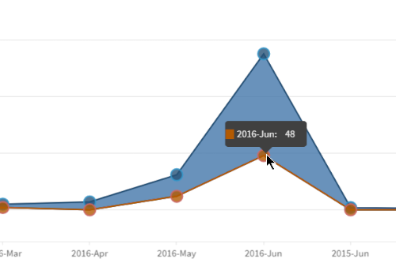

<a id="top"></a>

# QdtPicasso


Create a chart in [Picasso.js](https://picassojs.com/) using the Engine API ([Nov 2019 docs](https://help.qlik.com/en-US/sense-developer/November2019/APIs/EngineAPI/index.html)) in:
 - [Vanilla JavaScript](#html-and-vanilla-javascript)
 - [React](#react-jsx)
 - [Angular](#angular)

### Properties

| prop             | type          | description   |
| :---: | :---: | :--- |
| type             | String        | `comboLineBarchart`, `horizontalBarchart`, `lineChart`, `multiLineChart`, `pie`, `piechart`, `scatterplot`, `verticalBarchart`, `stackedBarchart`, `verticalGauge`, `verticalRangeGauge`, `rangeArea`, `verticalGroupBarchart` |
| cols             | Array         | `[dimension, measure]` |
| options          | Object        | `color` |
| prio             | String        | `canvas` or `svg`. If omitted, it defaults to canvas |


### HTML (and Vanilla JavaScript)

- See the [HTML Template](https://github.com/qlik-demo-team/qdt-components/blob/master/docs/usage/Html.md) for the
basic page setup. The two main items are:
  - qdt-components.js `<script>` tag in the `<head>` 
  - root HTML element in the `<body>` with desired id; example: `<div id="qdt1"></div>`
- Here is a simple example of the JavaScript required

```js
// main.js

// ============
// configuration options for qdtComponents; see template link above for specifics
var options = {
  config: { /* host, port, appid, etc. */ },
  connections: { /* vizApi, engineAPI */}
}

// ============
// #1: Instantiate new instance of QdtComponents
var qdtComponents = new QdtComponents(options.config, options.connections);

// ============
// #2: select element where you'll be placing the Picasso chart
var element = document.getElementById('qdt1');

// ============
// #3: render the chart
qdtComponents.render(
  "QdtPicasso", 
  {
    type: 'verticalBarchart', 
    cols: [
      'Champion_Full',
      "=Sum(if(Club = [Champion], [Total Compensation]))"
    ], 
    outerHeight: 400,
  }, 
  element
);
```

[[↑] Back to top](#top)

### React (JSX)

```jsx
<QdtComponent
  type="QdtPicasso"
  props={{
    type: 'horizontalBarchart', 
    cols: ['Case Owner Group', '=Avg([Case Duration Time])'], 
    outerHeight: 300,
  }}
/>
```

[[↑] Back to top](#top)

### Angular


[[↑] Back to top](#top)

## Examples

|[Horizontal Barchart](./HorizontalBarChart)|[Vertical Barchart](./VerticalBarChart)|[Pie Chart](./PieChart)|[Scatterplot](./ScatterplotChart)|[Line Chart](./LineChart)|
|:---:|:---:|:---:|:---:|:---:|
|[](https://qdt-apps.qlik.com/qdt-components/react/#/picasso-horizontal-barchart)|[](https://qdt-apps.qlik.com/qdt-components/react/#/picasso-vertical-barchart)|[](https://qdt-apps.qlik.com/qdt-components/react/#/picasso-pie-chart)|[](https://qdt-apps.qlik.com/qdt-components/react/#/picasso-scatterplot)|[](https://qdt-apps.qlik.com/qdt-components/react/#/picasso-line-chart)|

|[Multi-Line Chart](./MultiLineChart)|[Stacked Bar Chart](./StackedBarChart)|[Gauge](./Gauge)|[Range Area](./RangeArea)|[Vertical Group Bar Chart](./VerticalGroupBarChart)|
|:---:|:---:|:---:|:---:|:---:|
|[](https://qdt-apps.qlik.com/qdt-components/react/#/picasso-multi-line-chart)|[](https://qdt-apps.qlik.com/qdt-components/react/#/stacked-barchart)|[](https://qdt-apps.qlik.com/qdt-components/react/#/gauge)|[](https://qdt-apps.qlik.com/qdt-components/react/#/picasso-range-area-chart)|[](https://qdt-apps.qlik.com/qdt-components/react/#/picasso-vertical-group-barchart)|

---

Since we have made all elements into individual components, you can create custom charts by mixing components like boxes and lines

| [Custom Combo Chart](https://qdt-apps.qlik.com/qdt-components/react/#/picasso-custom-combo-chart) | [Custom Group Barchart](https://qdt-apps.qlik.com/qdt-components/react/#/picasso-custom-vertical-group-barchart) |
| :----:                            |    :----:                     |
| [](https://qdt-apps.qlik.com/qdt-components/react/#/picasso-custom-combo-chart)| [](https://qdt-apps.qlik.com/qdt-components/react/#/picasso-custom-vertical-group-barchart) |


[[↑] Back to top](#top)