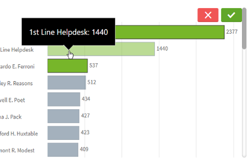
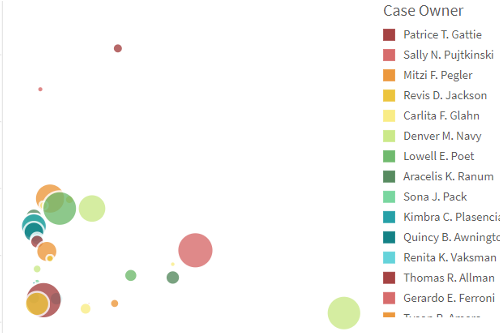
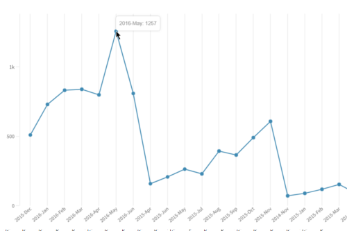
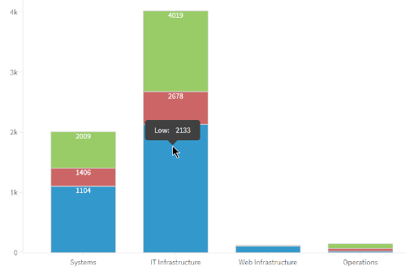
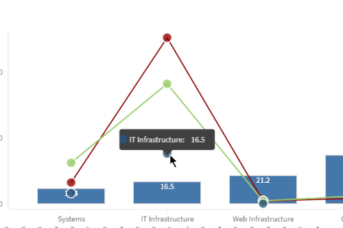

## Create a chart from the Engine Api

Set of charts created from the Engine Api and [Picasso.js](https://picassojs.com/).

### Properties

| prop             | type          | description   |
| ---------------- | ------------- | ------------- |
| type             | String        | `comboLineBarchart`, `horizontalBarchart`, `lineChart`, `multiLineChart`, `pie`, `piechart`, `scatterplot`, `verticalBarchart`, `stackedBarchart`, `verticalGauge`, `verticalRangeGauge`, `rangeArea`, `verticalGroupBarchart` |
| cols             | Array         | `[dimension, measure]` |
| options          | Object        | `color` |
| prio             | String        | `canvas` or `svg`. If omitted, it defaults to canvas |


### Html Code

```
<QdtComponent
  type="QdtPicasso"
  props={{
    type: 'horizontalBarchart', 
    cols: ['Case Owner Group', '=Avg([Case Duration Time])'], 
    outerHeight: 300,
  }}
/>
```


|[Horizontal Barchart](https://github.com/qlik-demo-team/qdt-components/tree/picasso-docs/docs/components/QdtPicasso/HorizontalBarChart)|[Vertical Barchart](./VerticalBarChart)|Pie Chart|Scatterplot|Line Chart|
|:---:|:---:|:---:|:---:|:---:|
|[](https://qdt-apps.qlik.com/qdt-components/react/#/picasso-horizontal-barchart)|[](https://qdt-apps.qlik.com/qdt-components/react/#/picasso-vertical-barchart)|[](https://qdt-apps.qlik.com/qdt-components/react/#/picasso-pie-chart)|[](https://qdt-apps.qlik.com/qdt-components/react/#/picasso-scatterplot)|[](https://qdt-apps.qlik.com/qdt-components/react/#/picasso-line-chart)|


| [Horizontal Barchart](https://github.com/qlik-demo-team/qdt-components/tree/picasso-docs/docs/components/QdtPicasso/HorizontalBarChart) | [Vertical Barchart](./VerticalBarChart) |
| :----: | :----:                     |
| [](https://qdt-apps.qlik.com/qdt-components/react/#/picasso-horizontal-barchart)| [](https://qdt-apps.qlik.com/qdt-components/react/#/picasso-vertical-barchart) |


| [Pie Chart](https://qdt-apps.qlik.com/qdt-components/react/#/picasso-pie-chart) | [Scatterplot](https://qdt-apps.qlik.com/qdt-components/react/#/picasso-scatterplot) |
| :----:                            |    :----:                     |
| [](https://qdt-apps.qlik.com/qdt-components/react/#/picasso-pie-chart)| [](https://qdt-apps.qlik.com/qdt-components/react/#/picasso-scatterplot) |


| [Line Chart](https://qdt-apps.qlik.com/qdt-components/react/#/picasso-line-chart) | [Multi Line Chart](https://qdt-apps.qlik.com/qdt-components/react/#/picasso-multi-line-chart) |
| :----:                            |    :----:                     |
| [](https://qdt-apps.qlik.com/qdt-components/react/#/picasso-line-chart)| [](https://qdt-apps.qlik.com/qdt-components/react/#/picasso-multi-line-chart) |


| [Stacked barchart](https://qdt-apps.qlik.com/qdt-components/react/#/stacked-barchart) | [Gauge](https://qdt-apps.qlik.com/qdt-components/react/#/gauge) |
| :----:                            |    :----:                     |
| [](https://qdt-apps.qlik.com/qdt-components/react/#/stacked-barchart)| [](https://qdt-apps.qlik.com/qdt-components/react/#/gauge) |


| [Range Area](https://qdt-apps.qlik.com/qdt-components/react/#/picasso-range-area-chart) | [Vertical Group Barhart](https://qdt-apps.qlik.com/qdt-components/react/#/picasso-vertical-group-barchart) |
| :----:                            |    :----:                     |
| [](https://qdt-apps.qlik.com/qdt-components/react/#/picasso-range-area-chart)| [](https://qdt-apps.qlik.com/qdt-components/react/#/picasso-vertical-group-barchart) |

---

Since we have made all elements into individual components, you can create custom charts by mixing components like boxes and lines

| [Custom Combo Chart](https://qdt-apps.qlik.com/qdt-components/react/#/picasso-custom-combo-chart) | [Custom Group Barchart](https://qdt-apps.qlik.com/qdt-components/react/#/picasso-custom-vertical-group-barchart) |
| :----:                            |    :----:                     |
| [](https://qdt-apps.qlik.com/qdt-components/react/#/picasso-custom-combo-chart)| [](https://qdt-apps.qlik.com/qdt-components/react/#/picasso-custom-vertical-group-barchart) |
