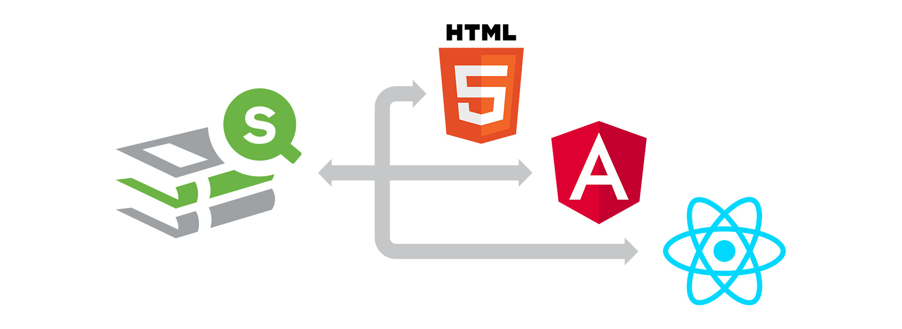

 

[]()

# Qlik Demo Team Components

- Qlik-powered components built by the Qlik Demo Team. For use with simple html, Angular2+ and React

### Installation
- `npm install --save qdt-components`

### Usage

#### Simple Html Example
- Download the [latest build](../blob/master/dist/qdt-components.js)
- Add the Html
```html
<head>
  <script type="text/javascript" src="qdt-components.js"></script>
</head>
<body>
  <qdt-component id="qdt1"></qdt-component>
</body>
```
- Add the Javascript
```javascript
<script type="text/javascript">
  var options = {
    config: {
      host: "sense-demo.qlik.com",
      secure: true,
      port: 443,
      prefix: "/",
      appId: "133dab5d-8f56-4d40-b3e0-a6b401391bde"
    },
    connections: { 
      vizApi: true, 
      engineApi: true 
    }
  }
  var qdtComponents = new QdtComponents(options.config, options.connections);
  var element = document.getElementById('qdt1');
  qdtComponents.render('QdtViz', {id: 'a5e0f12c-38f5-4da9-8f3f-0e4566b28398', height:'300px'}, element);
</script>
```
- [Live Demo](https://webapps.qlik.com/qdt-components/plain-html/index.html)

#### Angular 5 Component (cli)
- `npm install --save qdt-components`
- create an Angular 5 component that implements qdt-components
```javascript
import { Component, OnInit, ElementRef, Input } from '@angular/core';
import QdtComponents from 'qdt-components';

const options = {
  config: {
    host: "sense-demo.qlik.com",
    secure: true,
    port: 443,
    prefix: "",
    appId: "133dab5d-8f56-4d40-b3e0-a6b401391bde"
  },
  connections: { 
    vizApi: true, 
    engineApi: true 
  }
}

@Component({
  selector: 'qdt-component',
  templateUrl: './qdt-component.component.html',
  styleUrls: ['./qdt-component.component.less']
})
export class QdtComponent implements OnInit {

  @Input() type: string;
  @Input() props: object;

  static qdtComponents = new QdtComponents(options.config, options.connections);

  constructor(private elementRef: ElementRef) { }

  ngOnInit() {
    QdtComponent.qdtComponents.render(this.type, this.props, this.elementRef.nativeElement);
  }
  
}
```

#### React
- `npm install --save qdt-components`
- create a React component that implements qdt-components
```javascript
import React from 'react';
import PropTypes from 'prop-types';
import QdtComponents from 'qdt-components';

const options = {
  config: {
    host: "sense-demo.qlik.com",
    secure: true,
    port: 443,
    prefix: "",
    appId: "133dab5d-8f56-4d40-b3e0-a6b401391bde"
  },
  connections: { 
    vizApi: true, 
    engineApi: true 
  }
}

const qdtComponents = new QdtComponents(options.config, options.connections);

export default class QdtComponent extends React.Component {
  static propTypes = {
    type: PropTypes.string.isRequired,
    props: PropTypes.object.isRequired,
  }
  componentDidMount() {
    const { type, props } = this.props;
    qdtComponents.render(type, props, this.node);
  }

  render() {
    return (
      <div ref={(node) => { this.node = node; }} />
    );
  }
}
```

### Component Docs ###

#### QdtViz
This component can be used to create or get a native Qlik Sense viz. If you define the `id` prop, then it will get that Qlik Sense viz. If you define the `type`, `cols`, and `options` props it will create a new viz. The `width` and `height` props are both optional, and default to '100%'.

| prop             | type          | description   |
| ---------------- | ------------- | ------------- |
| id               | String        | Id for an existng visualization |
| type             | String        | [see here][vizApiCreate] |
| cols             | Array         | [see here][vizApiCreate] |
| options          | Object        | [see here][vizApiCreate] |
| width            | String        | Sets width of viz |
| height           | String        | Sets height of viz |

#### QdtFilter
This creates a custom filter dropdown. If `cols` is defined, `qListObjectDef` will be ignored.

| prop             | type          | description   |
| ---------------- | ------------- | ------------- |
| cols             | Array         | [see here][cols] |
| qListObjectDef   | Object        | [see here][qListObjectDef] |

[vizApiCreate]: https://help.qlik.com/en-US/sense-developer/February2018/Subsystems/APIs/Content/CapabilityAPIs/VisualizationAPI/create-method.htm
[cols]: https://help.qlik.com/en-US/sense-developer/February2018/Subsystems/APIs/Content/CapabilityAPIs/VisualizationAPI/columns.htm
[qListObjectDef]: https://help.qlik.com/en-US/sense-developer/February2018/Subsystems/EngineAPI/Content/GenericObject/PropertyLevel/ListObjectDef.htm

#### QdtSelectionToolbar
This populated a toolbar with the current app selections.
* [Live Example](https://webapps.qlik.com/qdt-components/plain-html/picasso-horizontalbarchart.html).

| prop             | type          | description   |
| ---------------- | ------------- | ------------- |
| height           | String        | Sets object height |

#### QdtBarchart
This creates a barchart based on [Picasso.js](https://picassojs.com/).
* [Live Example](https://webapps.qlik.com/qdt-components/plain-html/picasso-horizontalbarchart.html).

| prop             | type          | description   |
| ---------------- | ------------- | ------------- |
| type             | String        | `horizontal` |
| cols             | Array         | `[dimension, measure]` |
| options          | Object        | `barcolor` |
| width            | String        | Sets width of viz, default 100% |
| height           | String        | Sets height of viz, default 100% |

#### QdtPicasso - lineChart
This creates a Line Chart based on [Picasso.js](https://picassojs.com/).
* [Live Example](https://webapps.qlik.com/qdt-components/react/index.html#/picasso-line-chart).

| prop             | type          | description   |
| ---------------- | ------------- | ------------- |
| type             | String        | `lineChart` |
| cols             | Array         | `[dimension, measure]` |
| options          | Object        | `color` |

#### QdtSearch
This creates a search input field based on [Leonardo UI - input](https://qlik-oss.github.io/leonardo-ui/input.html).
* Tooltips are also based on [Leonardo UI - Tooltip](https://qlik-oss.github.io/leonardo-ui/tooltip.html)
* [Live Example](https://webapps.qlik.com/qdt-components/react/index.html#/search).

| prop             | type          | description   |
| ---------------- | ------------- | ------------- |
| cols             | Array         | `[dimension]` |
| invert           | Boolean       | false         |
| placeholder      | String        | `Search for`  |
| tooltipDock      | String        | `'top', 'right', 'bottom', 'left' `|
| tooltipContent   | String        | `<h5>Tooltip Header</h5> more content here.` |
| showGo           | Boolean       | false         |


### Changelog ###

##### 1.1.9 #####
* Added Spinning loader

##### 1.1.8 #####
* Add more Picasso charts (Scotterplot, Linechart, Combo chart)

##### 1.1.6 #####
* Minor fixes for the Horizontal Barchart and the Selection Toolbar

##### 1.1.5 #####
* Add Picasso Horizontal Barchart

##### 1.1.4 #####
* Fix the Selection Toolbar
