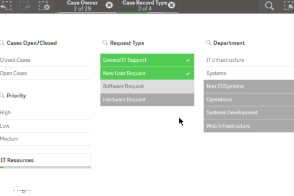
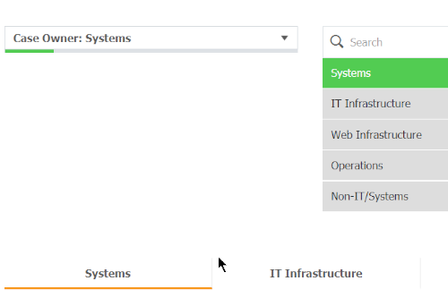
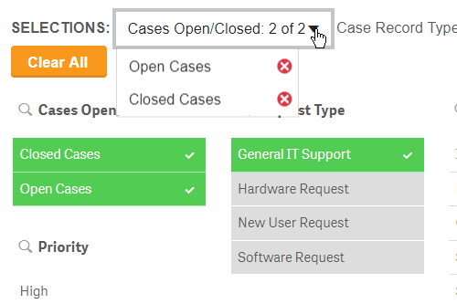
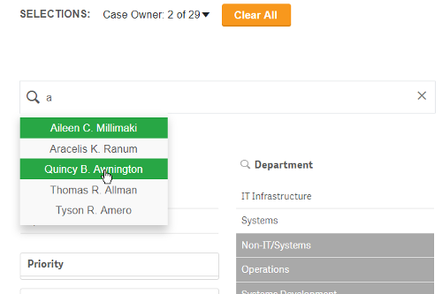
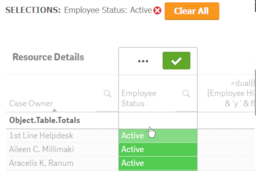
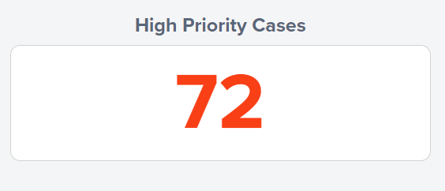

 

# Qdt Components

Qlik-powered components built by the Qlik Demo Team (aka Qdt). For use with simple HTML (Vanilla JavaScript), Angular6, React 16, and Vue 2

### Installation
`npm install --save qdt-components`

### Live Demo with the latest additions
- https://qdt-apps.qlik.com/qdt-components/react/

---

### Usage

Click below to see how you can use qdt-components

* [On a simple HTML page](docs/usage/Html.md)

* [With Angular](docs/usage/Angular.md)

* [With React](docs/usage/React.md)

* [With Vue](docs/usage/Vue.md)

---

### Components

| [QtdViz](docs/components/QdtViz.md)| [QdtCurrentSelections](docs/components/QdtCurrentSelections.md)| [QdtFilter](docs/components/QdtFilter.md) | [QdtSelectionToolbar](docs/components/QdtSelectionToolbar.md)     |
| :----:| :----: |:----: |:----: |
|   | |   |  |
|Visualization API|Visualization API|Engine API|Engine API|

| [QdtPicasso](docs/components/QdtPicasso/)| [QdtSearch](docs/components/QdtSearch.md)| [QtdMapBox](docs/components/QdtMapBox.md)| [QdtTable](docs/components/QdtTable.md)                           |
| :----:| :----: |:----: |:----: |
||   |  | |
|Engine API|Engine API|Engine API|Engine API|

| [QdtSequencer](docs/components/QdtSequencer.md)|[QdtKpi](docs/components/QdtKpi.md)| | |
| :----:| :----: | :----: | :----: |
|  |  |  |  |
|Engine API|Engine API| | |

---

### Contributing

Please see [CONTRIBUTING](https://github.com/qlik-demo-team/qdt-components/blob/master/CONTRIBUTING.md) to learn more.

### [Version Log](https://github.com/qlik-demo-team/qdt-components/blob/master/docs/components/QdtMapBox.md)
